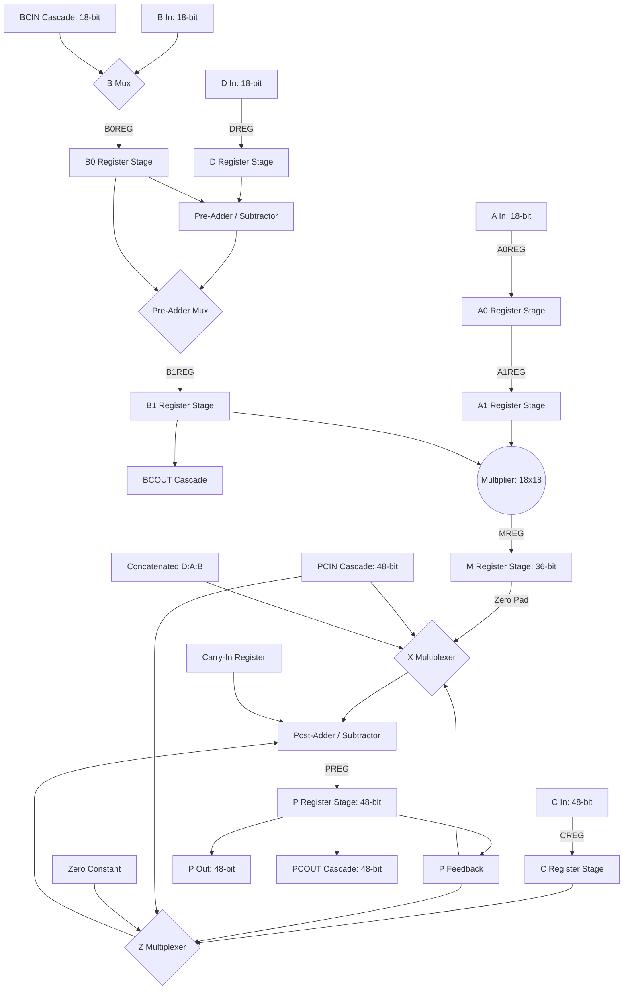

# Xilinx DSP48A1 Hardware Design & Verification

This repository contains a Verilog HDL model and simulation environment for a simplified **Xilinx DSP48A1** (Digital Signal Processing) slice. This module is commonly used in FPGA architectures for high-performance arithmetic operations, such as filtering, convolution, accumulation, and matrix multiplication.

---

## Table of Contents
1. [Project Overview](#1-project-overview)
2. [Block Architecture & Data Flow](#2-block-architecture--data-flow)
3. [File Structure & Components](#3-file-structure--components)
4. [Interface Specifications](#4-interface-specifications)
   - [4.1. Input/Output Ports](#41-inputoutput-ports)
   - [4.2. Configuration Parameters](#42-configuration-parameters)
5. [Detailed Pipeline Stages](#5-detailed-pipeline-stages)
6. [Design Review & Technical Observations](#6-design-review--technical-observations)
7. [Simulation & Verification](#7-simulation--verification)

---

## 1. Project Overview

The **DSP48A1** is a specialized arithmetic block designed to perform rapid mathematical computations. This project implements:
- An **$18 \times 18$-bit Multiplier** resulting in a 36-bit product.
- An **18-bit Pre-Adder/Subtractor** for pre-processing input data.
- Flexible **Multiplexers (X and Z)** to select operands from direct inputs, cascade paths, or feedback.
- A **48-bit Post-Adder/Subtractor** supporting accumulation, addition, and subtraction.
- Highly parameterizable **Pipelining Stages** to optimize maximum operating frequency ($F_{max}$).
- Support for **Cascade Ports** (`BCIN`/`BCOUT` and `PCIN`/`PCOUT`) to connect multiple DSP slices in series for wider operations (e.g., FIR filters).

---

## 2. Block Architecture & Data Flow

The DSP slice takes four data inputs: `A` (18-bit), `B` (18-bit), `C` (48-bit), and `D` (18-bit), plus control and cascade signals. The flow of data is governed by the 8-bit `OPMODE` register:



---

## 3. File Structure & Components

The workspace comprises the following key files:

*   **[dsp.v]**: The main data-path implementation of the DSP slice. It contains the logic for the pre-adder, multiplier, multiplexers, post-adder, and coordinates all pipeline stages.
*   **[dsp_module.v]**: A top-level wrapper module that instantiates `dsp` as `dsp48A1`, providing a standard clean interface.
*   **[ff_mux.v]**: A parameterized register-and-bypass block. Depending on its select configuration (`sel`), it either bypasses the input directly or outputs the register value synchronized to `CLK`, supporting both synchronous and asynchronous reset configurations.
*   **[mux4_1.v]**: A standard 4-to-1 multiplexer for 48-bit values, used for operand selection in the X and Z stages.
*   **[dsp_tb.v]**: A self-checking testbench that validates the functionality of the DSP slice through comprehensive test scenarios.
*   **[dsp_constraints.xdc]**: Xilinx design constraints for synthesis, specifying target pinouts and clock requirements (100 MHz target frequency).
*   **[run.do]** & **[do.do]**: Compilation and simulation scripts for ModelSim/QuestaSim to automate simulation and configure waveform displays.

---

## 4. Interface Specifications

### 4.1. Input/Output Ports

| Port Category | Port Name | Direction | Width | Description |
| :--- | :--- | :---: | :---: | :--- |
| **Data Inputs** | `A` | Input | 18 | Data input to the multiplier and concatenation block. |
| | `B` | Input | 18 | Data input to the multiplier/pre-adder (used if `B_INPUT` = `"DIRECT"`). |
| | `C` | Input | 48 | Data input to the Z Multiplexer (commonly used for add/sub/accumulate). |
| | `D` | Input | 18 | Data input to the pre-adder. |
| | `CARRYIN` | Input | 1 | Carry input from external logic. |
| **Data Outputs** | `M` | Output | 36 | Directly exposed registered multiplier output. |
| | `P` | Output | 48 | Main data output from the post-adder/accumulator. |
| | `CARRYOUT` | Output | 1 | Primary carry-out from the post-adder. |
| | `CARRYOUTF` | Output | 1 | Duplicate carry-out mirrored for routing/cascading. |
| **Control Inputs**| `CLK` | Input | 1 | Master clock signal. |
| | `OPMODE` | Input | 8 | Control byte configuration (operation select). |
| **Clock Enables** | `CEA` / `CEB` / `CED` | Input | 1 | Clock enable for `A`, `B`, and `D` registers respectively. |
| | `CEC` / `CEM` / `CEP` | Input | 1 | Clock enable for `C`, `M`, and `P` registers respectively. |
| | `CEOPMODE` / `CECARRYIN` | Input | 1 | Clock enable for `OPMODE` and Carry registers. |
| **Resets (Active-High)** | `RSTA` / `RSTB` / `RSTD` | Input | 1 | Reset for `A`, `B`, and `D` registers respectively. |
| | `RSTC` / `RSTM` / `RSTP` | Input | 1 | Reset for `C`, `M`, and `P` registers respectively. |
| | `RSTOPMODE` / `RSTCARRYIN` | Input | 1 | Reset for `OPMODE` and Carry registers. |
| **Cascade Interface**| `BCIN` | Input | 18 | Cascade B port input (used if `B_INPUT` = `"CASCADE"`). |
| | `BCOUT` | Output | 18 | Cascade B port output (copied from registered B1). |
| | `PCIN` | Input | 48 | Cascade P port input (from preceding DSP slice). |
| | `PCOUT` | Output | 48 | Cascade P port output (copied from registered P). |

### 4.2. Configuration Parameters

| Parameter Name | Allowed Values | Default Value | Description |
| :--- | :--- | :---: | :--- |
| `A0REG` / `A1REG` | `0`, `1` | `0`, `1` | Controls whether register stage A0 and A1 are bypassed (0) or active (1). |
| `B0REG` / `B1REG` | `0`, `1` | `0`, `1` | Controls whether register stage B0 and B1 are bypassed (0) or active (1). |
| `CREG` / `DREG` | `0`, `1` | `1`, `1` | Configures the input register for ports `C` and `D`. |
| `MREG` / `PREG` | `0`, `1` | `1`, `1` | Configures the output registers for the multiplier output `M` and post-adder `P`. |
| `CARRYINREG` / `CARRYOUTREG` | `0`, `1` | `1`, `1` | Configures registers for carry-in and carry-out. |
| `OPMODEREG` | `0`, `1` | `1` | Configures the `OPMODE` control input register. |
| `CARRYINSEL` | `"OPMODE5"`, `"CARRYIN"` | `"OPMODE5"` | Selects carry source: `OPMODE[5]` or the `CARRYIN` input port. |
| `B_INPUT` | `"DIRECT"`, `"CASCADE"` | `"DIRECT"` | Configures B-input source from either port `B` or cascade input `BCIN`. |
| `RSTTYPE` | `"SYNC"`, `"ASYNC"` | `"SYNC"` | Selects synchronous vs. asynchronous reset behavior for all registers. |

---

## 5. Detailed Pipeline Stages

The design supports up to 4 pipeline stages to maintain a high clock frequency during complex computations:

1.  **Stage 1 (Input Alignment)**: Inputs `A`, `B`, `C`, `D`, and `OPMODE` are registered at the boundary using `A0REG`, `B0REG`, `CREG`, `DREG`, and `OPMODEREG`.
2.  **Stage 2 (Pre-Adder / Operand Buffering)**: If the pre-adder is enabled (`OPMODE[3] = 1`), `D` and `B0` are added/subtracted. The result (or bypassed `B0`) is registered into the `B1` register (controlled by `B1REG`), and the `A0` register flows to the `A1` register (controlled by `A1REG`).
3.  **Stage 3 (Product Generation)**: The `A1` and `B1` outputs are multiplied ($18 \times 18$). The resulting 36-bit product is registered into the `M` register (controlled by `MREG`).
4.  **Stage 4 (Post-Addition / Accumulation)**: The X and Z multiplexers feed the post-adder/subtractor. The final result is registered into the `P` register (controlled by `PREG`).

---

## 7. Simulation & Verification

The project is verified using a self-checking testbench (`dsp_tb.v`).

### 7.1. Test Cases Traced in the Testbench

1.  **Post-Reset Verification**:
    Asserts all reset signals (`RSTA`, etc.) and verifies that outputs `P`, `M`, and carry flags clear to zero.
2.  **DSP Path 1 (Pre-Adder Subtract + Multiply + Post-Adder Subtract)**:
    - Input parameters: `A = 20`, `B = 10`, `C = 350`, `D = 25`.
    - `OPMODE` = `8'b11011101`.
    - Pre-adder performs subtraction (`D - B`): $25 - 10 = 15$ (`BCOUT = 15`).
    - Multiplier computes product ($A \times 15$): $20 \times 15 = 300$ (`M = 300`).
    - Post-adder performs subtraction of multiplier output from C: $350 - (300 + 0) = 50$ (`P = 50`).
3.  **DSP Path 2 (Pre-Adder Add + Multiply + Post-Adder Zero Bypass)**:
    - Input parameters: `A = 20`, `B = 10`, `C = 350`, `D = 25`.
    - `OPMODE` = `8'b00010000`.
    - Pre-adder performs addition (`D + B`): $25 + 10 = 35$ (`BCOUT = 35`).
    - Multiplier computes product ($A \times 35$): $20 \times 35 = 700$ (`M = 700`).
    - Post-adder multiplexers select zero: `P = 0`.
4.  **DSP Path 3 (Bypass Pre-Adder + Multiply + Feedback Mode)**:
    - `OPMODE` = `8'b00001010`. Both X and Z multiplexers select feedback `PCOUT`.
    - Post-adder performs addition: `P = P + P = 2 * P` (stays `0`).
    - Multiplier output `M = 200`.
5.  **DSP Path 4 (Concatenation Mode + Carry-In from OPMODE + Subtraction)**:
    - Input parameters: `A = 5`, `B = 6`, `C = 350`, `D = 25`, `PCIN = 3000`.
    - `OPMODE` = `8'b10100111`.
    - X Multiplexer selects concatenated `{D[11:0], A[17:0], B[17:0]}`, which evaluates to `48'h019000040006`.
    - Z Multiplexer selects cascade input `PCIN` ($3000$).
    - Post-adder performs subtraction: $PCIN - (X + CIN) = 3000 - (48'h019000040006 + 1) = -1717988553807$.
    - The output matches the expected 48-bit two's complement value: `48'hfe6fffec0bb1`.

### 7.2. Running the Simulation

A QuestaSim/ModelSim script (`run.do`) is provided. Run the following command in the QuestaSim console to execute compile and simulation:

```tcl
do run.do
```

This will compile the HDL source files, load the testbench, add waves, and run the simulation to completion.
